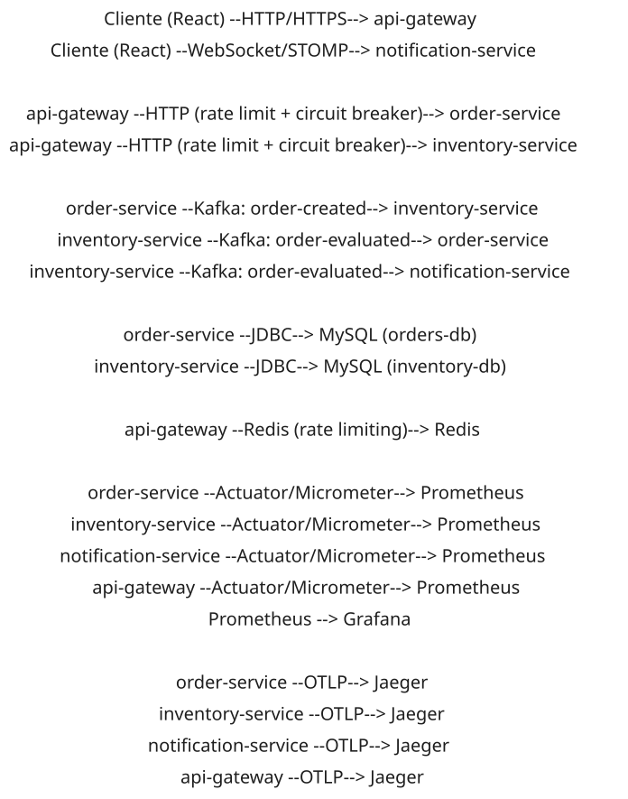
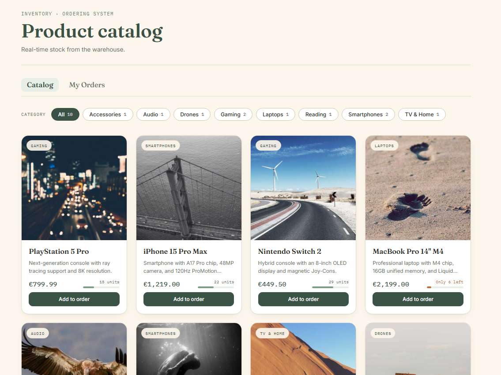
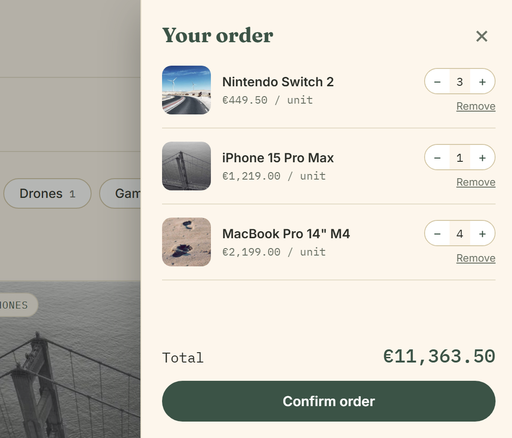
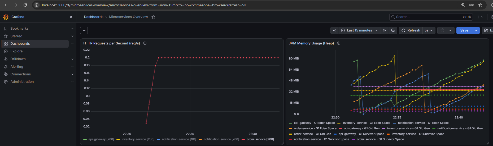
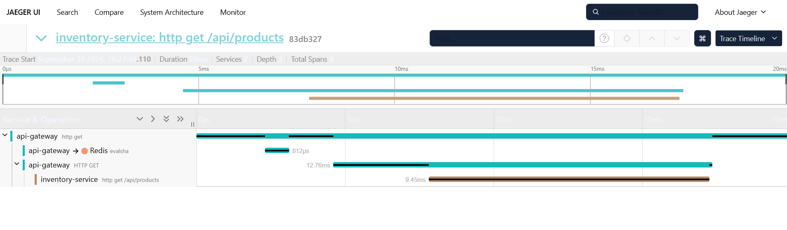

[](README.md) [](#)

---

# Sistema de Pedidos e Inventario

[](https://openjdk.org/projects/jdk/21/)
[](https://spring.io/projects/spring-boot)
[](https://spring.io/projects/spring-cloud-gateway)
[](https://kafka.apache.org/)
[](https://redis.io/)
[](https://react.dev/)
[](https://www.docker.com/)
[]()
[]()
[](https://github.com/DebHatim/pedidos-microservicios/actions/workflows/ci.yml)
[](https://hatimdebboun.dev)

Plataforma de e-commerce basada en microservicios donde un usuario crea un pedido, el sistema reserva el stock de forma
asíncrona y le notifica en tiempo real si el pedido se confirma o se rechaza por falta de existencias. Arquitectura
orientada a eventos con Apache Kafka como núcleo de comunicación entre servicios, gateway centralizado con resiliencia
(rate limiting, retries, circuit breaker) y notificaciones push vía WebSocket.

---

## Demo


*Añadir productos al carrito, confirmar el pedido y ver la notificación de confirmación/rechazo llegar en tiempo real
vía WebSocket en el momento en que inventory-service evalúa el stock disponible.*

## Arquitectura



Cuatro servicios independientes, cada uno con su propia responsabilidad y (cuando aplica) su propia base de datos:

- **api-gateway**: punto de entrada único. Enruta `/api/orders/**` a order-service, `/api/products/**` a
  inventory-service y `/ws/**` a notification-service. Aplica rate limiting (Redis), reintentos y circuit breaker por
  ruta.
- **order-service**: crea el pedido en estado `PENDING`, lo persiste en su propia base MySQL y publica el evento
  `order-created` en Kafka. Escucha `order-evaluated` para actualizar el pedido a `CONFIRMED` o `REJECTED`.
- **inventory-service**: mantiene el catálogo de productos y su stock en su propia base MySQL. Escucha
  `order-created`, comprueba stock disponible, lo descuenta si es suficiente y publica `order-evaluated`.
- **notification-service**: puente entre Kafka y el cliente. Escucha `order-evaluated` y reenvía la notificación al
  frontend por WebSocket/STOMP, sin base de datos propia.

La comunicación entre order-service e inventory-service es siempre asíncrona vía Kafka: si inventory-service cae,
order-service sigue aceptando pedidos con normalidad y los eventos se acumulan hasta que el consumidor vuelve a estar
disponible.

## Stack

| Capa              | Tecnología                                                                 |
|-------------------|----------------------------------------------------------------------------|
| Backend           | Java 21 · Spring Boot 4.1                                                  |
| Gateway           | Spring Cloud Gateway (WebFlux)                                             |
| Mensajería        | Apache Kafka (modo KRaft, sin Zookeeper)                                   |
| Resiliencia       | Resilience4j (circuit breaker) · Retry · Rate limiting (Redis)             |
| Persistencia      | JPA/Hibernate · MySQL 8 (una base de datos por servicio)                   |
| Tiempo real       | WebSocket · STOMP                                                          |
| Documentación API | springdoc-openapi (Swagger UI) por servicio                                |
| Observabilidad    | Spring Boot Actuator · Micrometer · Prometheus · Grafana · Jaeger (OTLP)   |
| Testing           | JUnit 5 · Mockito · Testcontainers (MySQL + Kafka) · Awaitility            |
| Frontend          | React 18 · Vite · @stomp/stompjs                                           |
| Infraestructura   | Docker Compose (4 microservicios, 2 MySQL, Kafka, Redis, frontend + nginx) |
| CI/CD             | GitHub Actions (tests automatizados en cada push/PR)                       |
| Build             | Maven · Lombok                                                             |

## Funcionalidades

- Catálogo de productos con filtro por categoría, gauge visual de stock y estados de carga/error/vacío
- Carrito de compra con control de cantidades por stock disponible y creación de pedido (`POST /api/orders`)
- Consulta del estado de un pedido por id (`GET /api/orders/{id}`)
- Evaluación de stock en tiempo real mediante consumidor Kafka en inventory-service, con descuento atómico de stock
- Notificaciones instantáneas de confirmación/rechazo del pedido al frontend vía WebSocket/STOMP, sin necesidad de
  refrescar la página
- Gateway centralizado con rate limiting por IP (Redis), reintentos automáticos en rutas GET y circuit breaker
  configurado por servicio de destino, con controllers de fallback
- Reposición manual de stock por producto (`POST /api/products/{id}/stock`)
- Manejo estructurado de errores (`GlobalExceptionHandler`) y de fallos en los listeners Kafka
- Documentación de API interactiva vía Swagger UI en cada microservicio
- Métricas expuestas por Actuator/Prometheus y trazas distribuidas vía OpenTelemetry/Jaeger, visualizables en Grafana
- Diseño visual propio (paleta sage/crema) servido en producción mediante Dockerfile multi-stage + nginx

## Capturas de pantalla

<table>
  <tr>
    <td style="width: 50%; text-align: center;">
      
      <p><em>Catálogo: filtro por categoría, gauge de stock y estados de carga</em></p>
    </td>
    <td style="width: 50%; text-align: center;">
      
      <p><em>Carrito: gestión de cantidades y confirmación del pedido en tiempo real</em></p>
    </td>
  </tr>
  <tr>
    <td style="width: 50%; text-align: center;">
      
      <p><em>Métricas en tiempo real de los 4 servicios vía Prometheus/Grafana</em></p>
    </td>
    <td style="width: 50%; text-align: center;">
      
      <p><em>Traza distribuida del flujo order-service → Kafka → inventory-service</em></p>
    </td>
  </tr>
</table>

## Decisiones de diseño

**¿Por qué microservicios y no un monolito?**
Decisión consciente para aprender y demostrar el patrón, no porque el dominio (pedidos + inventario) lo exija por
tamaño. Se gana aislamiento de fallos y escalado independiente por servicio; se pierde consistencia transaccional
fuerte entre servicios, resuelta aquí con consistencia eventual vía Kafka. Para un proyecto pequeño con un solo
equipo, un monolito bien hecho sigue siendo la decisión correcta la mayoría de las veces y este proyecto es una
excepción deliberada, orientada a demostrar el patrón.

**¿Por qué Kafka y no una llamada REST directa entre order-service e inventory-service?**
El desacoplamiento permite que ambos servicios evolucionen de forma independiente. Si inventory-service cae, los
pedidos se siguen aceptando y los eventos se acumulan en Kafka hasta que el consumidor vuelve, sin perder ninguno.

**¿Por qué una base de datos por servicio en vez de una compartida?**
Cada servicio es dueño exclusivo de sus datos. Evita acoplamiento a nivel de esquema entre order-service e
inventory-service y permite migrar o escalar cada base de forma independiente.

**¿Por qué KRaft en vez de Zookeeper?**
Menos piezas móviles en el docker-compose y es la dirección en la que Kafka está migrando por defecto; no tiene
sentido introducir una dependencia que el propio proyecto Kafka está deprecando.

**¿Por qué WebSocket/STOMP y no polling para las notificaciones?**
El polling requeriría que el cliente pregunte cada X segundos si el pedido cambió de estado, generando carga
innecesaria en el gateway. WebSocket mantiene una conexión abierta y notification-service empuja la notificación en
el momento exacto en que inventory-service evalúa el pedido.

**¿Por qué circuit breaker en el gateway y no en cada servicio individual?**
El gateway es el único punto por el que pasa todo el tráfico externo; centralizar ahí la protección evita duplicar la
misma configuración de resiliencia en cuatro sitios distintos y permite fallar rápido antes de saturar un servicio
que ya está degradado.

**¿Por qué tracing distribuido si ya hay métricas agregadas?**
Las métricas dicen que algo va mal (latencia alta, tasa de error); el tracing distribuido dice dónde exactamente
dentro de la cadena order-service → Kafka → inventory-service → Kafka → notification-service se está produciendo el
problema, algo que un dashboard de métricas agregadas no puede mostrar por sí solo.

**Lecciones aprendidas / troubleshooting**

- `.ignoreTypeHeaders()` es obligatorio en el `JacksonJsonDeserializer` al consumir eventos de otro servicio: por
  defecto Kafka usa el header `__TypeId__` con la clase del productor, que no existe en el classpath del consumidor.
  Sin ese flag, la deserialización falla en silencio y los eventos acaban en el dead-letter topic.
- `@EnableKafka` no se activa solo con tener `spring-kafka` en el classpath. En Spring Boot 4.1.0 los
  `@KafkaListener` no se registraban pese a tener el `ConcurrentKafkaListenerContainerFactory` bien definido, sin
  ningún error visible — los pedidos se quedaban en `PENDING` para siempre. Lo detecté comparando logs de arranque
  entre servicios y confirmando con `kafka-consumer-groups.sh --list` que el consumer group nunca se registraba.
- Testcontainers 2.x movió `MySQLContainer` a `org.testcontainers.mysql`. Usar la clase antigua hacía que, sin un
  Kafka real en el test, los listeners reintentaran conexión en bucle y colgaran la JVM ~30s al final de cada test.
  La solución fue levantar también un `KafkaContainer` real en los tests de integración.
- Las trazas no se propagaban entre servicios porque solo tenía registrado el `DefaultTracingObservationHandler`,
  que crea spans en local pero no propaga el header `traceparent`. Añadir un bean `Propagator` y los handlers de
  envío/recepción (`PropagatingSenderTracingObservationHandler`/`PropagatingReceiverTracingObservationHandler`) lo
  resolvió. En el gateway reactivo hizo falta además `reactor.context-propagation: auto`.

## Dependencias principales

**api-gateway**

| Dependencia                                              | Propósito                                               |
|----------------------------------------------------------|---------------------------------------------------------|
| spring-boot-starter-webflux                              | Stack reactivo sobre el que corre Spring Cloud Gateway  |
| spring-cloud-starter-gateway-server-webflux              | Enrutamiento reactivo hacia los microservicios          |
| spring-cloud-starter-circuitbreaker-reactor-resilience4j | Circuit breaker por ruta                                |
| spring-boot-starter-data-redis-reactive                  | Backend de Redis para el rate limiter del gateway       |
| resilience4j-spring-boot4                                | Configuración de resiliencia (circuit breaker, retry)   |
| micrometer-registry-prometheus                           | Métricas del gateway en formato Prometheus vía Actuator |
| micrometer-tracing-bridge-otel                           | Trazas del gateway hacia Jaeger vía OTLP                |
| springdoc-openapi-starter-webflux-ui                     | Swagger UI agregando la documentación de los servicios  |

**order-service / inventory-service**

| Dependencia                         | Propósito                                                     |
|-------------------------------------|---------------------------------------------------------------|
| spring-boot-starter-web             | Capa REST sobre Tomcat embebido                               |
| spring-boot-starter-data-jpa        | Persistencia JPA/Hibernate contra MySQL                       |
| spring-boot-starter-validation      | Validación de DTOs de entrada (`@Valid`)                      |
| spring-kafka                        | Producción/consumo de eventos con Apache Kafka                |
| mysql-connector-j                   | Driver JDBC de MySQL                                          |
| resilience4j-spring-boot4           | Anotaciones de circuit breaker, retry y timeout               |
| micrometer-registry-prometheus      | Métricas en formato Prometheus vía Actuator                   |
| micrometer-tracing-bridge-otel      | Trazas distribuidas hacia Jaeger vía OTLP                     |
| springdoc-openapi-starter-webmvc-ui | Swagger UI generado a partir del código                       |
| spring-kafka-test                   | Utilidades de test para Kafka                                 |
| testcontainers (mysql, kafka)       | Contenedores reales de MySQL y Kafka en tests de integración  |
| awaitility                          | Espera asíncrona en tests de integración (sin `Thread.sleep`) |

**notification-service**

| Dependencia                         | Propósito                                               |
|-------------------------------------|---------------------------------------------------------|
| spring-boot-starter-web             | Capa REST básica y arranque del servidor embebido       |
| spring-boot-starter-websocket       | Endpoint STOMP sobre WebSocket para notificaciones push |
| spring-kafka                        | Consumo del evento `order-evaluated`                    |
| resilience4j-spring-boot4           | Resiliencia en el consumidor Kafka                      |
| micrometer-registry-prometheus      | Métricas en formato Prometheus vía Actuator             |
| micrometer-tracing-bridge-otel      | Trazas distribuidas hacia Jaeger vía OTLP               |
| springdoc-openapi-starter-webmvc-ui | Swagger UI generado a partir del código                 |

## Probarlo en local

**Requisito único:** tener Docker instalado.

```bash
git clone https://github.com/DebHatim/pedidos-microservicios.git
cd pedidos-microservicios
docker compose up -d
```

Ese único comando levanta las 2 bases MySQL, Redis, Kafka, los 4 microservicios y el frontend. Sin necesidad de
instalar Java, Maven ni Node.

- Frontend: `http://localhost`
- API Gateway: `http://localhost:8080`
- Swagger UI (por servicio, vía gateway o puerto directo): `http://localhost:8081/swagger-ui.html` (order-service),
  `http://localhost:8082/swagger-ui.html` (inventory-service)
- Health check: `http://localhost:8080/actuator/health`
- Prometheus: `http://localhost:9090`
- Grafana: `http://localhost:3000`
- Jaeger UI: `http://localhost:16686`

> Las bases de datos MySQL corren con usuario `root` y contraseña `root`, configuración pensada solo para desarrollo
> local, no para un despliegue expuesto a internet.

<details>
<summary>Desarrollo de un microservicio sin Docker (opcional)</summary>

Si quieres iterar directamente sobre un servicio con Maven, necesitas Java 21, Maven, y Kafka + MySQL corriendo (puedes
levantar solo la infraestructura con `docker compose up -d kafka redis order-mysql inventory-mysql`).

```bash
cd order-service
./mvnw spring-boot:run
```

Y para el frontend:

```bash
cd frontend
npm install
npm run dev
```

Variable de entorno relevante: `VITE_API_BASE_URL` (frontend, build-time, por defecto `http://localhost:8080`).
</details>

## Testing

Cobertura de la lógica de negocio con **JUnit 5 + Mockito**, además de tests de integración con **Testcontainers**
(MySQL + Kafka reales) que verifican el flujo completo extremo a extremo:

- `ProductServiceTest`, `StockReservationServiceTest` - lógica de catálogo y reserva/descuento de stock
- `OrderCreatedListenerTest` - consumo del evento `order-created` en inventory-service
- `GlobalExceptionHandlerTest` - manejo estructurado de errores
- `OrderFlowIntegrationTest` (order-service) - crea un pedido real, simula `order-evaluated` vía Kafka y verifica el
  cambio de estado (`CONFIRMED`/`REJECTED`) contra MySQL real
- `InventoryFlowIntegrationTest` (inventory-service) - publica `order-created` en Kafka real, verifica el descuento
  de stock en MySQL real y la publicación de `order-evaluated`

```bash
./mvnw test
```

(Los tests de integración requieren Docker disponible para levantar los contenedores de Testcontainers.)

Cada push y cada pull request ejecutan la suite completa vía GitHub Actions.

<details>
<summary>Capturas técnicas</summary>
<br>

<table>
  <tr>
    <td style="width: 50%; text-align: center;">
      
      <p><em>Suite de pruebas ejecutada con éxito</em></p>
    </td>
    <td style="width: 50%; text-align: center;">
      
      <p><em>API documentada y explorable a través de Swagger UI</em></p>
    </td>
  </tr>
  <tr>
    <td colspan="2" style="text-align: center;">
      
      <p><em>El sistema entero arrancando con un simple <code>docker compose up -d</code></em></p>
    </td>
  </tr>
</table>

</details>

## Autor

**Hatim Debboun** · [Portfolio](https://hatimdebboun.dev) · [LinkedIn](https://linkedin.com/in/hatimdebboun) · [GitHub](https://github.com/DebHatim)
