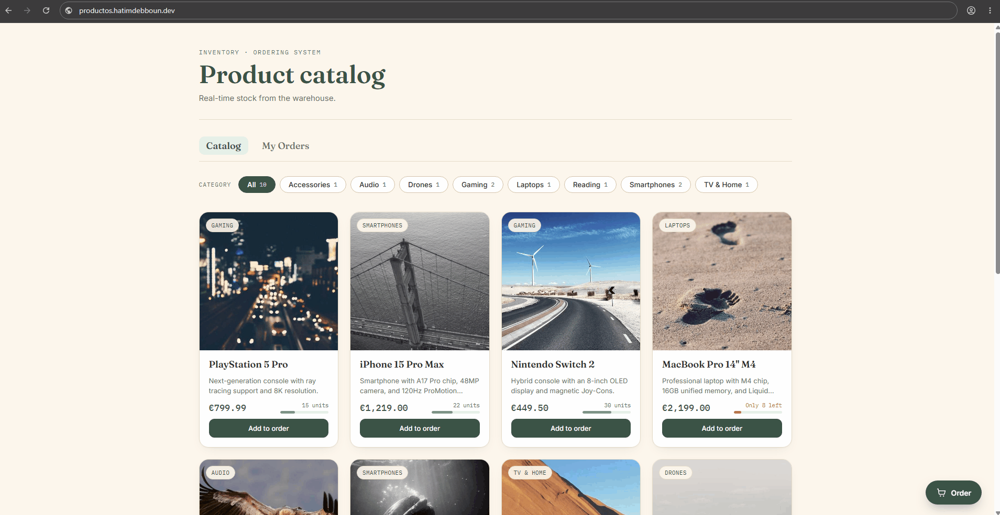
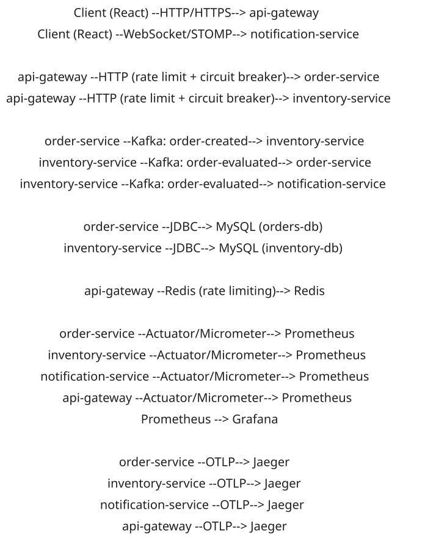
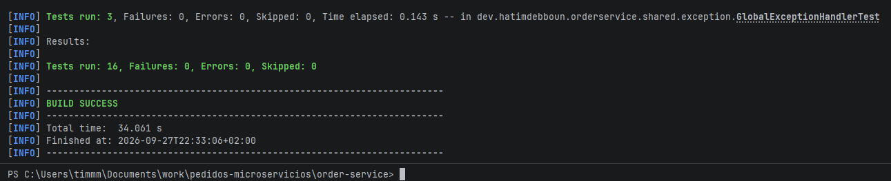
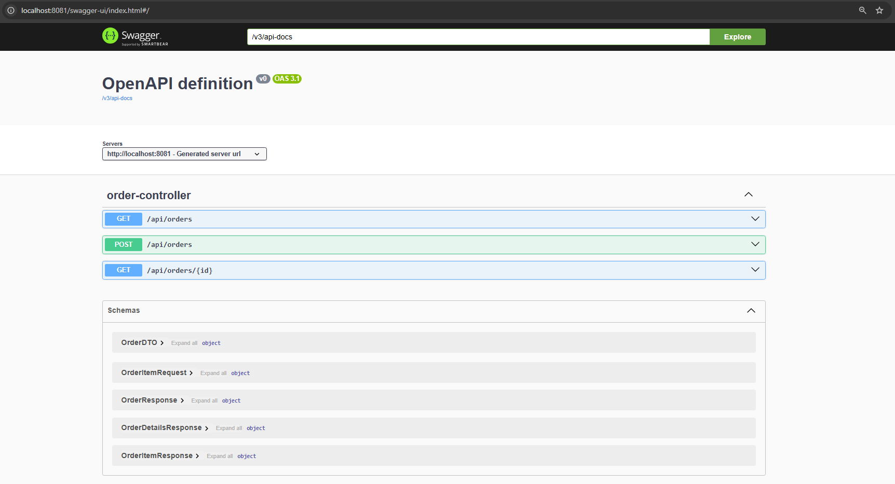
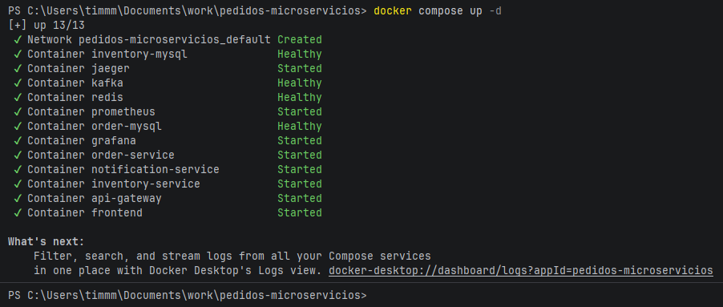

[](#) [](README.md)

---

# Real-Time Order & Inventory System

[](https://openjdk.org/projects/jdk/21/)
[](https://spring.io/projects/spring-boot)
[](https://spring.io/projects/spring-cloud-gateway)
[](https://kafka.apache.org/)
[](https://redis.io/)
[](https://react.dev/)
[](https://www.docker.com/)
[]()
[]()
[](https://github.com/DebHatim/pedidos-inventario-microservicios/actions/workflows/ci.yml)
[](https://hatimdebboun.dev)

Microservices-based e-commerce platform where a user places an order, the system reserves stock asynchronously, and
notifies them in real time whether the order was confirmed or rejected due to insufficient stock. Event-driven
architecture with Apache Kafka at its core, a centralized gateway with resilience (rate limiting, retries, circuit
breaker) and push notifications via WebSocket.

---

## Demo



*Add products to the cart, place the order, and watch the confirmation/rejection notification arrive in real time via
WebSocket the moment inventory-service evaluates the available stock.*

## Architecture



Four independent services, each with its own responsibility and (where it applies) its own database:

- **api-gateway**: single entry point. Routes `/api/orders/**` to order-service, `/api/products/**` to
  inventory-service and `/ws/**` to notification-service. Applies rate limiting (Redis), retries and circuit breaker
  per route.
- **order-service**: creates the order in `PENDING` state, persists it to its own MySQL database and publishes the
  `order-created` event to Kafka. Listens for `order-evaluated` to update the order to `CONFIRMED` or `REJECTED`.
- **inventory-service**: keeps the product catalog and its stock in its own MySQL database. Listens for
  `order-created`, checks available stock, deducts it if sufficient and publishes `order-evaluated`.
- **notification-service**: bridge between Kafka and the client. Listens for `order-evaluated` and forwards the
  notification to the frontend via WebSocket/STOMP, with no database of its own.

Communication between order-service and inventory-service is always asynchronous via Kafka: if inventory-service goes
down, order-service keeps accepting orders normally and events queue up until the consumer comes back online.

## Stack

| Layer          | Technology                                                                |
|----------------|---------------------------------------------------------------------------|
| Backend        | Java 21 · Spring Boot 4.1                                                 |
| Gateway        | Spring Cloud Gateway (WebFlux)                                            |
| Messaging      | Apache Kafka (KRaft mode, no Zookeeper)                                   |
| Resilience     | Resilience4j (circuit breaker) · Retry · Rate limiting (Redis)            |
| Persistence    | JPA/Hibernate · MySQL 8 (one database per service)                        |
| Real-time      | WebSocket · STOMP                                                         |
| API Docs       | springdoc-openapi (Swagger UI) per service                                |
| Observability  | Spring Boot Actuator · Micrometer · Prometheus · Grafana · Jaeger (OTLP)  |
| Testing        | JUnit 5 · Mockito · Testcontainers (MySQL + Kafka) · Awaitility           |
| Frontend       | React 18 · Vite · @stomp/stompjs                                          |
| Infrastructure | Docker Compose (4 microservices, 2 MySQL, Kafka, Redis, frontend + nginx) |
| CI/CD          | GitHub Actions (automated tests on every push/PR)                         |
| Build          | Maven · Lombok                                                            |

## Features

- Product catalog with category filtering, a visual stock gauge, and loading/error/empty states
- Shopping cart with quantity limits based on available stock and order creation (`POST /api/orders`)
- Order status lookup by id (`GET /api/orders/{id}`)
- Real-time stock evaluation via a Kafka consumer in inventory-service, with atomic stock deduction
- Instant order confirmation/rejection notifications pushed to the frontend via WebSocket/STOMP, no page refresh
  needed
- Centralized gateway with per-IP rate limiting (Redis), automatic retries on GET routes and a circuit breaker per
  downstream service, with fallback controllers
- Manual stock replenishment per product (`POST /api/products/{id}/stock`)
- Structured error handling (`GlobalExceptionHandler`) and Kafka listener failure handling
- Interactive API documentation via Swagger UI on each microservice
- Metrics exposed via Actuator/Prometheus and distributed traces via OpenTelemetry/Jaeger, visualized in Grafana
- Custom UI design (sage/cream palette) served in production via a multi-stage Dockerfile + nginx

## Screenshots

<table>
  <tr>
    <td style="width: 50%; text-align: center;">
      
      <p><em>Catalog: category filter, stock gauge and loading states</em></p>
    </td>
    <td style="width: 50%; text-align: center;">
      
      <p><em>Cart: quantity management and real-time order confirmation</em></p>
    </td>
  </tr>
</table>

## Design decisions

**Why microservices instead of a monolith?**
A deliberate choice to learn and demonstrate the pattern, not because the domain (orders + inventory) demands it by
size. It gains fault isolation and independent scaling per service; it loses strong transactional consistency across
services, resolved here with eventual consistency via Kafka. For a small project with a single team, a well-built
monolith remains the right call most of the time, and this project is a deliberate exception meant to demonstrate the
pattern.

**Why Kafka instead of a direct REST call between order-service and inventory-service?**
Decoupling lets both services evolve independently. If inventory-service goes down, orders keep being accepted and
events queue up in Kafka until the consumer comes back, without losing any.

**Why a database per service instead of a shared one?**
Each service exclusively owns its data. It avoids schema-level coupling between order-service and inventory-service
and lets each database be migrated or scaled independently.

**Why KRaft instead of Zookeeper?**
Fewer moving parts in the docker-compose setup, and it's the direction Kafka is migrating to by default; there's no
point introducing a dependency the Kafka project itself is deprecating.

**Why WebSocket/STOMP instead of polling for notifications?**
Polling would require the client to ask every X seconds whether the order changed state, adding unnecessary load on
the gateway. WebSocket keeps a connection open and notification-service pushes the notification the exact moment
inventory-service evaluates the order.

**Why circuit breaker in the gateway and not in each individual service?**
The gateway is the single point all external traffic passes through; centralizing protection there avoids duplicating
the same resilience configuration in four different places and allows failing fast before overloading an already
degraded service.

**Why distributed tracing if there are already aggregated metrics?**
Metrics tell you something is wrong (high latency, error rate); distributed tracing tells you exactly where in the
order-service → Kafka → inventory-service → Kafka → notification-service chain the problem is happening — something
an aggregated metrics dashboard can't show on its own.

**Lessons learned / troubleshooting**

- `.ignoreTypeHeaders()` is mandatory on `JacksonJsonDeserializer` when consuming events published by another
  service. By default, Kafka uses the `__TypeId__` header to resolve the target class, and that header contains the
  *producer's* fully qualified class name, which doesn't exist on the *consumer's* classpath. Omitting this flag on a
  consumer causes silent deserialization failures that end up in the dead-letter topic after retries.
- `@EnableKafka` isn't auto-configured just by having `spring-kafka` on the classpath. On Spring Boot 4.1.0,
  `@KafkaListener`s weren't being registered even though the `ConcurrentKafkaListenerContainerFactory` was correctly
  defined as a bean. No error logs, no exceptions on context startup — the consumers simply never activated, leaving
  orders permanently stuck in `PENDING`. Diagnosed by comparing startup logs between services (the producer logged
  fine, the consumer left no trace even with `DEBUG` on) and confirming with `kafka-consumer-groups.sh --list` that
  the consumer group never registered with the broker.
- Testcontainers 2.x reorganized packages: `MySQLContainer` now lives in `org.testcontainers.mysql`, not
  `org.testcontainers.containers`. With the deprecated class and no real Kafka container, listeners kept retrying the
  connection against `localhost:9092` in a loop, hanging the JVM for ~30s at the end of each test even when the test
  itself passed. The fix was to spin up a real `KafkaContainer` in the integration tests as well.

## Key dependencies

**api-gateway**

| Dependency                                               | Purpose                                            |
|----------------------------------------------------------|----------------------------------------------------|
| spring-boot-starter-webflux                              | Reactive stack Spring Cloud Gateway runs on        |
| spring-cloud-starter-gateway-server-webflux              | Reactive routing to the microservices              |
| spring-cloud-starter-circuitbreaker-reactor-resilience4j | Circuit breaker per route                          |
| spring-boot-starter-data-redis-reactive                  | Redis backend for the gateway's rate limiter       |
| resilience4j-spring-boot4                                | Resilience configuration (circuit breaker, retry)  |
| micrometer-registry-prometheus                           | Gateway metrics in Prometheus format via Actuator  |
| micrometer-tracing-bridge-otel                           | Gateway traces to Jaeger via OTLP                  |
| springdoc-openapi-starter-webflux-ui                     | Swagger UI aggregating the services' documentation |

**order-service / inventory-service**

| Dependency                          | Purpose                                                |
|-------------------------------------|--------------------------------------------------------|
| spring-boot-starter-web             | REST layer on embedded Tomcat                          |
| spring-boot-starter-data-jpa        | JPA/Hibernate persistence against MySQL                |
| spring-boot-starter-validation      | Input DTO validation (`@Valid`)                        |
| spring-kafka                        | Producing/consuming events with Apache Kafka           |
| mysql-connector-j                   | MySQL JDBC driver                                      |
| resilience4j-spring-boot4           | Circuit breaker, retry and timeout annotations         |
| micrometer-registry-prometheus      | Metrics in Prometheus format via Actuator              |
| micrometer-tracing-bridge-otel      | Distributed traces to Jaeger via OTLP                  |
| springdoc-openapi-starter-webmvc-ui | Swagger UI generated from the code                     |
| spring-kafka-test                   | Test utilities for Kafka                               |
| testcontainers (mysql, kafka)       | Real MySQL and Kafka containers in integration tests   |
| awaitility                          | Async waiting in integration tests (no `Thread.sleep`) |

**notification-service**

| Dependency                          | Purpose                                              |
|-------------------------------------|------------------------------------------------------|
| spring-boot-starter-web             | Basic REST layer and embedded server bootstrap       |
| spring-boot-starter-websocket       | STOMP over WebSocket endpoint for push notifications |
| spring-kafka                        | Consuming the `order-evaluated` event                |
| resilience4j-spring-boot4           | Resilience on the Kafka consumer                     |
| micrometer-registry-prometheus      | Metrics in Prometheus format via Actuator            |
| micrometer-tracing-bridge-otel      | Distributed traces to Jaeger via OTLP                |
| springdoc-openapi-starter-webmvc-ui | Swagger UI generated from the code                   |

## Run it locally

**Only requirement:** Docker installed.

```bash
git clone https://github.com/DebHatim/pedidos-inventario-microservicios.git
cd pedidos-inventario-microservicios
docker compose up -d
```

This single command spins up both MySQL databases, Redis, Kafka, the 4 microservices and the frontend. No need to
install Java, Maven or Node.

- Frontend: `http://localhost`
- API Gateway: `http://localhost:8080`
- Swagger UI (per service, via gateway or direct port): `http://localhost:8081/swagger-ui.html` (order-service),
  `http://localhost:8082/swagger-ui.html` (inventory-service)
- Health check: `http://localhost:8080/actuator/health`
- Prometheus: `http://localhost:9090`
- Grafana: `http://localhost:3000`
- Jaeger UI: `http://localhost:16686`

> The MySQL databases run with user `root` and password `root`, a setup meant only for local development, not for a
> deployment exposed to the internet.

<details>
<summary>Developing a service without Docker (optional)</summary>

If you want to iterate directly on a service with Maven, you need Java 21, Maven, and Kafka + MySQL running (you can
spin up just the infrastructure with `docker compose up -d kafka redis order-mysql inventory-mysql`).

```bash
cd order-service
./mvnw spring-boot:run
```

And for the frontend:

```bash
cd frontend
npm install
npm run dev
```

Relevant environment variable: `VITE_API_BASE_URL` (frontend, build-time, defaults to `http://localhost:8080`).
</details>

## Testing

Business logic coverage with **JUnit 5 + Mockito**, plus integration tests with **Testcontainers** (real MySQL +
Kafka) verifying the full end-to-end flow:

- `ProductServiceTest`, `StockReservationServiceTest` - catalog logic and stock reservation/deduction
- `OrderCreatedListenerTest` - consuming the `order-created` event in inventory-service
- `GlobalExceptionHandlerTest` - structured error handling
- `OrderFlowIntegrationTest` (order-service) - creates a real order, simulates `order-evaluated` via Kafka and
  verifies the state change (`CONFIRMED`/`REJECTED`) against real MySQL
- `InventoryFlowIntegrationTest` (inventory-service) - publishes `order-created` to real Kafka, verifies stock
  deduction against real MySQL and the `order-evaluated` publication

```bash
./mvnw test
```

(Integration tests require Docker to be available to spin up the Testcontainers.)

Every push and pull request runs the full suite via GitHub Actions.

<details>
<summary>Technical screenshots</summary>
<br>

<table>
  <tr>
    <td style="width: 50%; text-align: center;">
      
      <p><em>Test suite running successfully</em></p>
    </td>
    <td style="width: 50%; text-align: center;">
      
      <p><em>API documented and explorable via Swagger UI</em></p>
    </td>
  </tr>
  <tr>
    <td colspan="2" style="text-align: center;">
      
      <p><em>The whole system starting with a single <code>docker compose up -d</code></em></p>
    </td>
  </tr>
</table>

</details>

## Author

**Hatim Debboun** · [Portfolio](https://hatimdebboun.dev) · [LinkedIn](https://linkedin.com/in/hatimdebboun) · [GitHub](https://github.com/DebHatim)